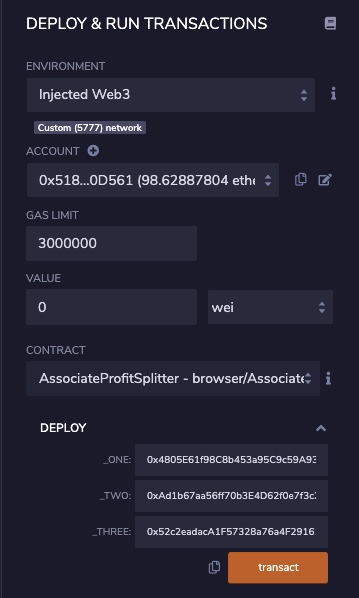
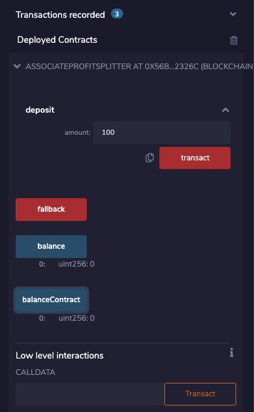

# Solidity: ProfitSplitter

"Smart Contracts to automate employee compensation payments"

### Purpose

In this project, we are using Smart Contracts to automate some of our company finances - starting with employee compensations - to make the processes practically automatic. 

### The AssociateProfitSplitter Contract

In this contract, we will be using a `constructor` to set employee addresses with  `payable` addresses to create recipient accounts for employee compensations and avoid hardcoding the actual addresses. We will also be using a a `deposit` function that splits the disbursed amount equally and distributes it among the designated employee addresses.

First, we define the variables for three employees, set to public and payable.
```
    address payable employee_one;
    address payable employee_two;
    address payable employee_three;
```

A `constructor` function is created to accept address payable `_one, _two, _three` which we will use to set the employee addresses and avoid hardcoding the actual employee addresses.

```
constructor(address payable _one, address payable _two, address payable _three) public { }

```

Next, we will create a `balance` function to return the contract's current balance. 

```
    function balance() public view returns(uint) {
        return balanceContract;
    }
```

The `deposit` function will split the disbursement amount into equal parts (three) and transfer to each of the employee accounts. Within the same function, we will transfer the balance remainer back to the owner address during instances where the amount splitter leaves a remainder balance.

```
function deposit(uint amount) public payable {
        require(msg.sender == owner, "You don't own this account!");
        
        amount = msg.value / 3;
        
        employee_one.transfer(amount);
        employee_two.transfer(amount);
        employee_three.transfer(amount);
        
        msg.sender.transfer(msg.value - amount*3);
        
        balanceContract = address(this).balance;
    }
```
Finally, we will create a fallback function and run the  function from within. This will ensure that the logic in `deposit` executes if Ether is sent directly to the contract. 


```
function fallback() external payable {
        function() deposit;
    }
```

Once the contract has been completed, we will deploy it with specified employee addresses and test it by sending various amounts.





s